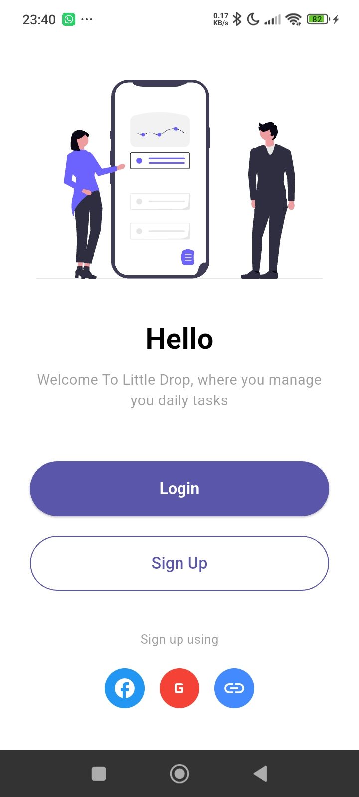
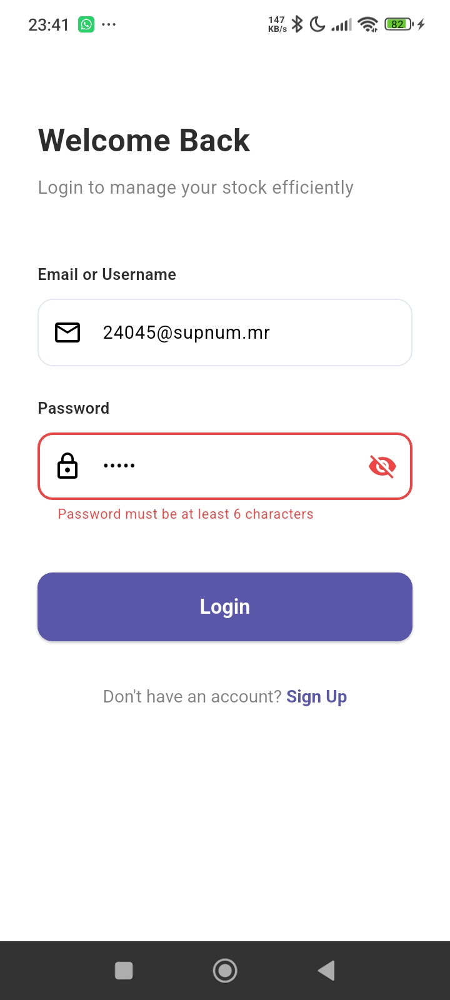
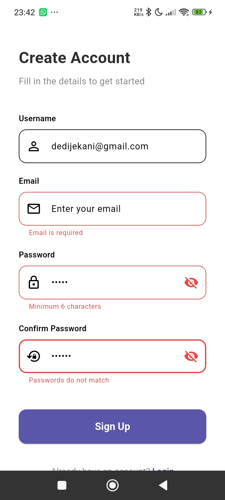
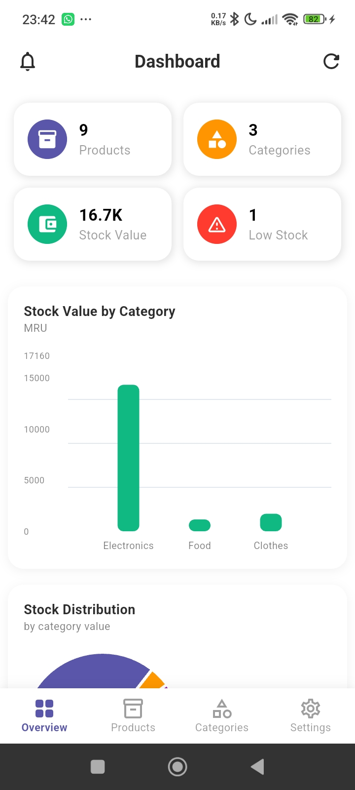
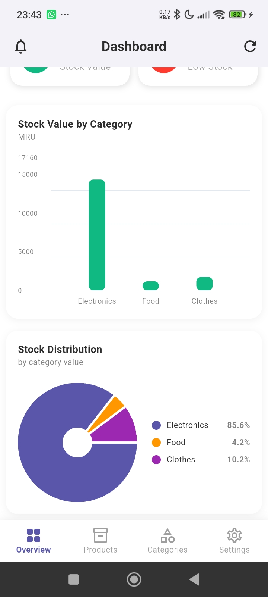
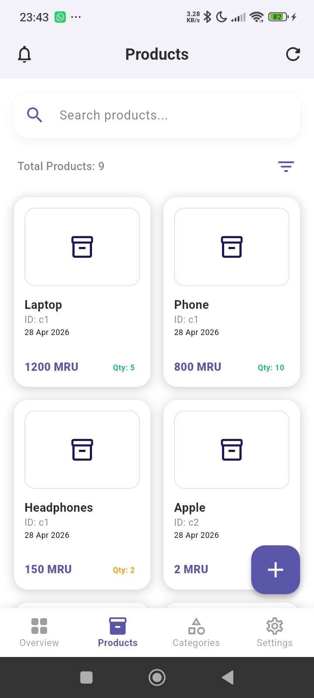
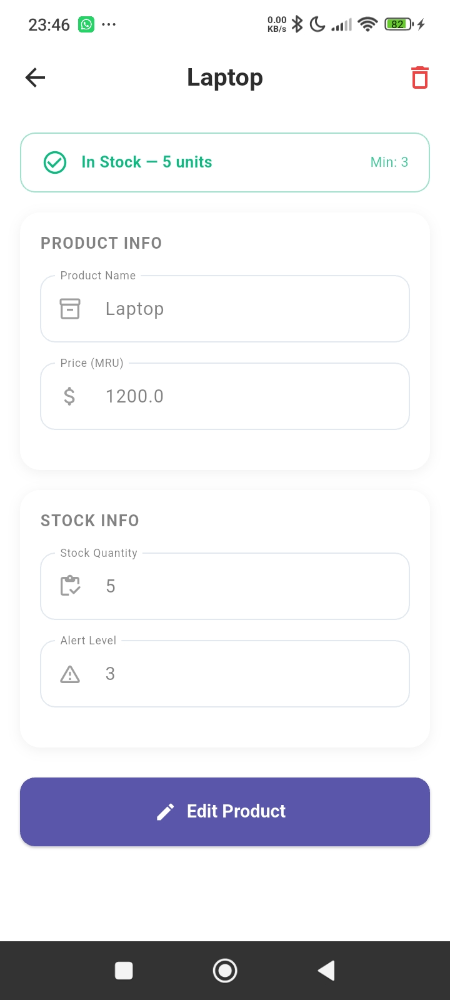
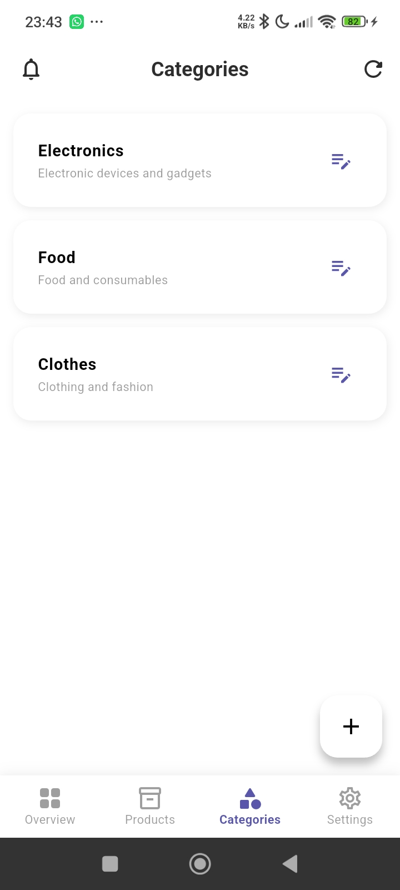
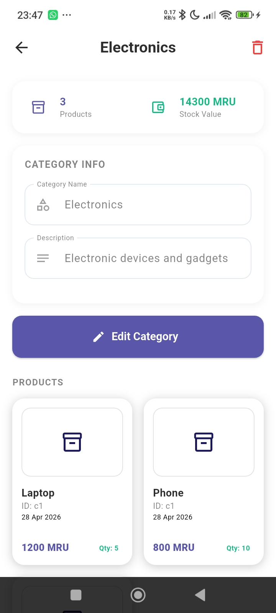
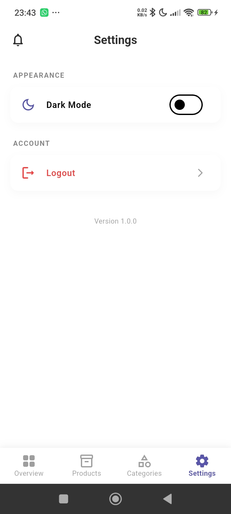

# 📦 Gestion de Stock Flutter

A modern, clean full-stack stock management mobile application built with Flutter.  
Integrated seamlessly with a Spring Boot REST API, featuring advanced inventory features, multi-tenant auditing, and full localization support.

---

## 📸 Screenshots

<table>
  <tr>
    <td align="center"><b>Onboarding</b></td>
    <td align="center"><b>Login</b></td>
    <td align="center"><b>Register</b></td>
  </tr>
  <tr>
    <td></td>
    <td></td>
    <td></td>
  </tr>
  <tr>
    <td align="center"><b>Dashboard</b></td>
    <td align="center"><b>Dashboard Charts</b></td>
    <td align="center"><b>Products</b></td>
  </tr>
  <tr>
    <td></td>
    <td></td>
    <td></td>
  </tr>
  <tr>
    <td align="center"><b>Product Details</b></td>
    <td align="center"><b>Categories</b></td>
    <td align="center"><b>Category Details</b></td>
  </tr>
  <tr>
    <td></td>
    <td></td>
    <td></td>
  </tr>
  <tr>
    <td align="center"><b>Settings</b></td>
    <td></td>
    <td></td>
  </tr>
  <tr>
    <td></td>
    <td></td>
    <td></td>
  </tr>
</table>

---

## 🏗️ Architecture

This project follows a clean **layered architecture** decoupled from data providers, enabling quick refactoring and centralized state tracking via Provider pattern.

## 📁 Project Structure

````text
.
├── core
│   ├── network
│   │   ├── api_client.dart
│   │   └── api_endpoints.dart
│   ├── theme
│   │   ├── app_colors.dart
│   │   └── app_theme.dart
│   └── utils
│       └── random_colors.dart
├── data
│   ├── models
│   │   ├── category_model.dart
│   │   ├── product_model.dart
│   │   ├── stock_movement_model.dart
│   │   └── supplier_model.dart
│   └── services
│       ├── analytics_service.dart
│       ├── stock_movement_service.dart
│       └── supplier_service.dart
├── generated
│   ├── intl
│   └── l10n.dart
├── l10n
│   ├── intl_ar.arb
│   ├── intl_en.arb
│   └── intl_fr.arb
├── main.dart
├── providers
│   ├── category_provider.dart
│   ├── dashboard_provider.dart
│   ├── product_provider.dart
│   ├── stock_movement_provider.dart
│   └── supplier_provider.dart
├── routes
│   ├── app_router.dart
│   └── app_routes.dart
├── screens
│   ├── auth
│   │   ├── login_page.dart
│   │   └── signup_page.dart
│   ├── dashboard
│   │   ├── dashboard_layout.dart
│   │   ├── details
│   │   │   ├── category_detail_page.dart
│   │   │   └── product_detail_page.dart
│   │   └── tabs
│   │       ├── add_category_page.dart
│   │       ├── add_movement_page.dart
│   │       ├── add_product_page.dart
│   │       ├── add_supplier_page.dart
│   │       ├── categories_page.dart
│   │       ├── index_page.dart
│   │       ├── movements_page.dart
│   │       ├── products_page.dart
│   │       ├── settings_page.dart
│   │       └── suppliers_page.dart
│   └── onboarding
│       └── main_page.dart
└── widgets
    ├── categories
    │   └── category_card.dart
    ├── charts
    │   ├── category_percentage_pie_chart.dart
    │   └── category_stock_bar_chart.dart
    ├── dashboard
    │   └── stats_card.dart
    ├── movements
    │   ├── movement_filter_chips.dart
    │   └── stock_movement_card.dart
    ├── products
    │   └── product_card.dart
    └── ui
        ├── app_search_bar.dart
        ├── language_selector.dart
        └── detail
            ├── detail_field.dart
            ├── detail_info_card.dart
            └── detail_stock_badge.dart

            ## ✅ Features

### 🔐 Authentication & Security
- JWT-based stateless authentication
- Role-based access control
- Secure navigation flow from dashboard

### 📊 Dashboard & Analytics
- Total Products, Categories, Stock Value (MRU)
- Low stock alerts
- Skeleton loading states
- Charts using `fl_chart`

### 📦 Products & Categories
- Advanced search & filtering
- Stock status indicators (In Stock / Low Stock / Out of Stock)
- Full CRUD operations

### 🤝 Suppliers Management
- Full CRUD (Create, Read, Update, Delete)
- Supplier profile tracking

### 🔄 Stock Movements (Audit Trail)
- IN / OUT / ADJUSTMENT tracking
- Timestamped history
- User traceability

### 🌍 Localization
- Arabic / English / French support
- Dynamic language switching via `.arb` files

---

## 🛠️ Tech Stack

| Technology | Usage |
|------------|------|
| Flutter | Mobile UI |
| Spring Boot | Backend API |
| Provider | State Management |
| fl_chart | Data visualization |
| Intl | Localization |

---

## 🚀 Getting Started

```bash id="setup-commands"
# Clone the repository
git clone https://github.com/your-username/gestion_de_stock_flutter.git

# Navigate into project
cd gestion_de_stock_flutter

# Install dependencies
flutter pub get

# Run app
flutter run
````
